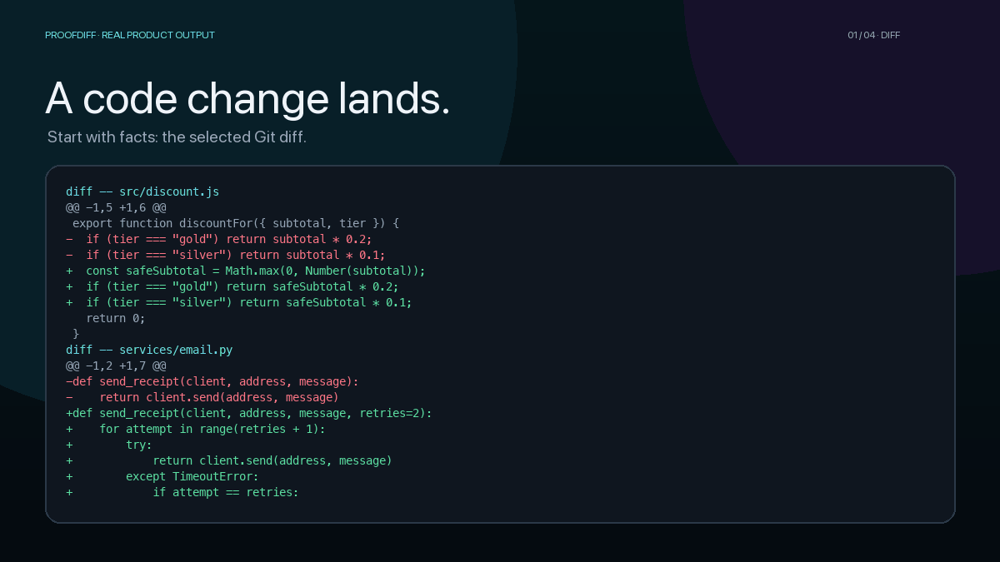

# ProofDiff

[](https://github.com/hzw0813/proofdiff/actions/workflows/ci.yml)
[](https://www.npmjs.com/package/proofdiff)
[](package.json)
[](LICENSE)

> ## Deterministic evidence for every code change.
>
> See what changed, what verification actually ran, and what remains unverified.

**No LLM / No upload / No account / No telemetry**

[](https://hzw0813.github.io/proofdiff/)

The walkthrough uses an actual fixture diff, actual ProofDiff execution, and the real interactive report—no hand-authored results. [Explore the live evidence gallery →](https://hzw0813.github.io/proofdiff/)

## Try it in seconds

Requires Git, Node.js 22+, and npm. From any Git repository with a change:

```bash
npx proofdiff --html proofdiff-report.html
```

That default is static-only: it inspects Git and parses supported source files, but does **not** execute repository code. Open `proofdiff-report.html` for the self-contained interactive report.

To install the CLI once, run `npm install --global proofdiff`.

> [!WARNING]
> `--run-checks` executes repository-defined tests, typechecks, and linters with your operating-system permissions. Timeouts, output limits, and a reduced environment are defense in depth—not a sandbox. Never enable it for untrusted code; see [SECURITY.md](SECURITY.md).

For a repository you explicitly trust:

```bash
npx proofdiff --run-checks --html proofdiff-report.html
```

### Exact test-target evidence support

ProofDiff can discover and run broader repository checks, but **Related test file passed** requires runner-qualified, per-target observations. Exact per-target pass evidence is currently supported for:

- Node.js built-in test runner (`node --test`)
- Jest for bounded root scripts such as `jest`, `jest --ci`, and `jest --runInBand`, optionally preceded by up to four literal `NAME=value` environment assignments or by a locally installed `cross-env` plus those assignments
- Vitest for bounded root scripts `vitest`, `vitest run`, or `vitest --run`, with the same bounded literal environment-prefix and local `cross-env` support
- pytest
- Python `unittest`

Recognized Jest/Vitest environment values are preserved in the exact-target runner process. Sensitive propagated environment names are surfaced in targeted-check provenance without exposing their values or changing evidence status. Vitest multi-project output may contain multiple valid suite records for one already-qualified exact physical target; ProofDiff aggregates those exact-path observations, while any failure still fails that target and malformed data still fails closed. Shell substitution/chaining, duplicate or excessive environment assignments, `cross-env-shell`, `dotenv`, `concurrently`, unsupported CLI/config shapes, package-manager layouts without a local `node_modules/<runner>` package, Mocha, AVA, and other runners remain unsupported for exact per-target pass evidence. Their repository commands may still run as deterministic checks, but ProofDiff fails closed instead of upgrading a file when it cannot establish exact target identity and a trustworthy non-skipped passing observation. See the [verification model](docs/verification-model.md) and [troubleshooting guide](docs/troubleshooting.md).

### Declare a test relationship ProofDiff cannot infer

When a repository has a real source-to-test relationship that bounded static analysis cannot discover, an expert can provide an exact, auditable relationship map instead of forcing ProofDiff to guess:

```json
{
  "version": 1,
  "relationships": [
    {
      "source": "src/payment.ts",
      "tests": ["test/payment.test.ts"]
    }
  ]
}
```

```bash
proofdiff --test-map proofdiff.test-map.json
proofdiff --test-map proofdiff.test-map.json --run-checks
```

A test map is **declaration provenance, not proof of coverage**. ProofDiff parses it as bounded data and accepts only exact repository-relative, Git-visible test-like source paths. A declaration can establish the intended source→test relationship for analysis, but it does **not** bypass runner qualification, explicit target supply, exact runtime observation, or the non-skipped-pass requirement. It does not show that changed symbols, lines, branches, assertions, or behavior were exercised. Invalid, escaping, stale, duplicate, unsupported, oversized, or symbolic-link maps are rejected instead of partially guessed.

For immutable `--base` and `--range` selections, a repository-local map must match the selected target commit's declaration content; for `--staged`, it must match the index. A repository-local map modified by the same immutable selection is rejected rather than being allowed to strengthen that change. Mutable working-tree analysis still permits editing a map alongside code for local iteration and reports that weaker governance provenance. A map outside the repository is an explicit external trust input rather than silently inheriting repository-history trust.

This is deliberately different from a “trust me, these tests cover it” switch. If a declared test cannot be qualified by a supported runner, the evidence boundary stops at `runner-qualification` and tells you so. If checks were not run, it stops at `target-invocation`. Only an independently qualified exact target with a trustworthy non-skipped passing observation can produce **Related test file passed**.

## Why ProofDiff?

AI review and ProofDiff answer different questions. AI reviewers can suggest possible issues; ProofDiff records reproducible evidence: the selected diff, inferred or explicitly declared test relationships, runner-qualified targets, per-target observations, checks, and the gaps that remain. Each file also carries an evidence boundary showing the strongest evidence actually observed, where stronger evidence stopped, whether ProofDiff failed closed, and a bounded next action. It never treats directory placement, a user declaration, or process exit alone as test execution, turns a passing target into changed-symbol coverage, or claims that a change is safe.

```text
PARTIAL  ·  highest risk HIGH  ·  2 files  ·  2 symbols
1 qualified target pass  0 partial  1 unverified  0 unknown  0 failed

UNVERIFIED services/email.py  HIGH 58
  Evidence: none observed; status is not a safety claim.

RELATED TEST FILE PASSED src/discount.js  LOW 10
  Evidence: 1 qualified related target observed passing
  Executed tests: test/checkout.test.js
```

## Read the evidence

| Visible result (JSON status) | What ProofDiff observed |
| --- | --- |
| **Related test file passed** (`verified`) | A related test path was established through supported static discovery or explicit declared relationship provenance, then runner-qualified, explicitly supplied, and observed with at least one non-skipped passing test for that exact target, with no relevant failure. ProofDiff did not observe whether changed symbols, lines, branches, or relevant assertions ran. |
| **Partially verified** | A relevant deterministic command passed, but no qualified related target produced a non-skipped passing observation. Zero-test, filtered-to-zero, all-skipped, and unavailable target observations cannot strengthen the result. |
| **Unverified** | Checks ran, but supplied no applicable successful evidence. |
| **Unknown** | No applicable check ran, or analysis could not reach a conclusion. |
| **Verification failed** | An applicable check failed, errored, or timed out. |

Inferred impact and test-like relationships are explicitly labeled static estimates; user-declared relationships are separately labeled as declarations rather than independently attested semantic relevance. Qualification reasons and per-target counts are inspectable in JSON and HTML details. The additive `evidenceBoundary` object explains the strongest observed evidence, stop stage/reason, fail-closed state, and safe next action without changing `schemaVersion: "1.0"`. When no relationship can be inferred, the next action can point to `--test-map`; a declaration still cannot bypass the later evidence stages.

## Use it in GitHub Actions

The released composite Action is available at `hzw0813/proofdiff@v0.5.3`. Use the released tag for normal stable integration, or the reviewed full commit SHA for an immutable security-sensitive pin. On `pull_request`, the Action can auto-resolve the exact PR base SHA when `base` is omitted; explicit `base` still wins. The released Action includes the `test-map` input for bounded declared relationship data. See the [complete workflow and trust guidance](docs/github-actions.md).

For immutable `--base`, `--range`, and `--staged` analysis, v0.5.3 conservatively binds filesystem-backed analysis to the selected Git state instead of mixing snapshots. Base/range analysis requires the selected target to be the checked-out `HEAD`; staged analysis requires tracked worktree content to match the index. Git-visible untracked inputs and ignored metadata/test inputs that could affect static discovery fail closed. With `--run-checks`, ignored repository-local runtime inputs are rejected more broadly because repository commands could consume them; bounded dependency/cache directories remain environment inputs. An explicitly supplied LCOV file can be accepted as that exact data artifact under its separate commit-binding checks, but it does not authorize sibling files.

The released Action writes a concise, bounded **ProofDiff · Change Evidence** job summary by default, so reviewers can see changed-file evidence without opening logs. It uses the same report as terminal/JSON/HTML output, requires no write token, and does not create PR comments. Full provenance remains in the log and optional HTML artifact.

## Useful commands

```bash
proofdiff                         # working tree, including untracked files
proofdiff --staged                # staged changes only
proofdiff --base origin/main      # merge-base comparison
proofdiff --range v1.0.0..HEAD    # explicit commit range
proofdiff --test-map proofdiff.test-map.json  # exact user-declared source→test relationships
proofdiff --json                  # stable machine-readable schema
proofdiff --github-summary summary.md  # bounded GitHub-flavored Markdown
proofdiff --fail-on partial       # require a qualified per-target pass for every changed file
```

TypeScript and JavaScript receive AST and repository-local dependency-graph analysis. Besides relative imports, ProofDiff can use bounded, data-only evidence from exact/single-wildcard TypeScript `paths` mappings and exact package self-exports. The nearest compiler config must include the importer through the supported bounded project-membership model, and package self-exports require an explicit export-aware resolution mode and an unambiguous condition choice. Post-`paths` lookup follows a deliberately narrow TypeScript subset: documented explicit-extension substitution in every mode, and extensionless file/index lookup only with explicit Bundler or Node10 resolution. Ambiguous project ownership, hidden metadata, versioned export conditions, and NodeNext import/require contexts remain unresolved. Those inferred edges are still static estimates: aliases and exports never qualify a test or imply execution. Exact user-declared test relationships are a separate provenance source and likewise do not imply execution. Python receives isolated standard-library AST analysis when Python is available, trying the platform-preferred interpreter and then the alternate candidate before visibly falling back to lexical analysis. Other files retain honest file-level diff and risk analysis without structural claims.

Full options: [`proofdiff --help`](docs/cli.md). Evidence semantics: [verification model](docs/verification-model.md). Demo provenance: [demo scenarios](docs/demo-scenarios.md). Common problems: [troubleshooting](docs/troubleshooting.md). Architecture and contribution guidance: [ARCHITECTURE.md](ARCHITECTURE.md) and [CONTRIBUTING.md](CONTRIBUTING.md).

ProofDiff is pre-1.0. Its evidence model, JSON schema, and CLI may evolve with release notes. MIT licensed.
