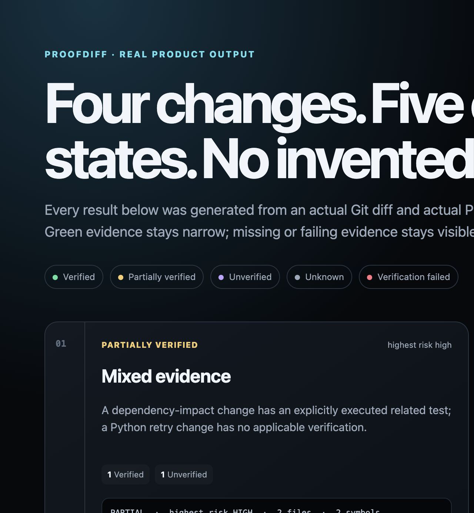

# ProofDiff

[](https://github.com/hzw0813/proofdiff/actions/workflows/ci.yml)
[](package.json)
[](LICENSE)

> **What evidence shows that this code change is safe?**

ProofDiff inspects a Git diff, finds changed symbols and likely dependents, discovers verification checks, and separates observed evidence from inference. It produces a focused terminal review queue and a self-contained interactive HTML report—locally, without an account, API key, upload, LLM, or telemetry.

```text
PARTIAL  ·  highest risk HIGH  ·  2 files  ·  2 symbols
1 verified  0 partial  1 unverified  0 unknown  0 failed

UNVERIFIED services/email.py  HIGH 58
  Evidence: none observed; status is not a safety claim.

VERIFIED   src/discount.js  LOW 10
  Evidence: 1 related test file explicitly executed
  Executed tests: test/checkout.test.js
```



The real-product [demo gallery](examples/demo-gallery.html) covers mixed evidence, an excluded related test, failing targeted verification, and an unsupported change. Regenerate every artifact with `npm run demo`; none are hand-authored results.

## Try it

Prerequisites: Git, Node.js 22+, and npm. Python is optional and improves Python AST analysis.

From a fresh clone:

```bash
npm ci
npm run build
node dist/cli.js --repo /path/to/your/repository --html proofdiff-report.html
```

Once installed as a package, the one-command experience is:

```bash
proofdiff --html proofdiff-report.html
```

By default ProofDiff performs static analysis only. To explicitly trust the repository and run its discovered test, typecheck, and lint commands:

```bash
proofdiff --run-checks --html proofdiff-report.html
```

Repository checks can execute arbitrary repository code. ProofDiff constrains duration and output and removes inherited secrets from the environment, but it is **not an OS sandbox**. Do not use `--run-checks` for untrusted code. See [SECURITY.md](SECURITY.md).

## What the statuses mean

| Status | Meaning |
| --- | --- |
| **Verified** | ProofDiff passed a statically related test file directly to a recognized runner and observed success. This is test-file execution evidence, never coverage or a guarantee. |
| **Partially verified** | A relevant deterministic check passed, but ProofDiff did not observe a related test file executing successfully. |
| **Unverified** | Checks ran, but none supplied applicable successful evidence. |
| **Unknown** | No applicable check ran, or analysis could not reach a conclusion. |
| **Verification failed** | An applicable check failed, errored, or timed out. |

Impact and test relationships are explicitly labeled static estimates. ProofDiff never presents them as runtime coverage or proof of correctness.

## Useful commands

```bash
proofdiff                         # working tree, including untracked files
proofdiff --staged                # staged changes only
proofdiff --base origin/main      # merge-base comparison
proofdiff --range v1.0.0..HEAD    # explicit commit range
proofdiff --json                  # stable machine-readable schema
proofdiff --run-checks --check test --timeout 180
proofdiff --fail-on partial       # CI policy: require every file to be verified
```

Full options: `proofdiff --help`. GitHub Actions setup: [docs/github-actions.md](docs/github-actions.md). Verification semantics: [docs/verification-model.md](docs/verification-model.md). Common problems: [docs/troubleshooting.md](docs/troubleshooting.md).

## Language support

- TypeScript and JavaScript: Babel AST, imports/exports, changed symbols, changed-line call references, and a local dependency graph.
- Python: isolated standard-library AST with changed symbols and changed-line call references when Python is available; visibly labeled lexical fallback otherwise.
- Other files: honest file-level diff and risk analysis without structural claims.

The adapter interface is intentionally small; see [ARCHITECTURE.md](ARCHITECTURE.md) to add a language.

## Project status

ProofDiff is pre-1.0. Its evidence model, JSON schema, and CLI may evolve with release notes. The implementation is local-only and has no telemetry or network code. See [ROADMAP.md](ROADMAP.md), [CHANGELOG.md](CHANGELOG.md), [RELEASE_AUDIT.md](RELEASE_AUDIT.md), and [CONTRIBUTING.md](CONTRIBUTING.md).

MIT licensed.
